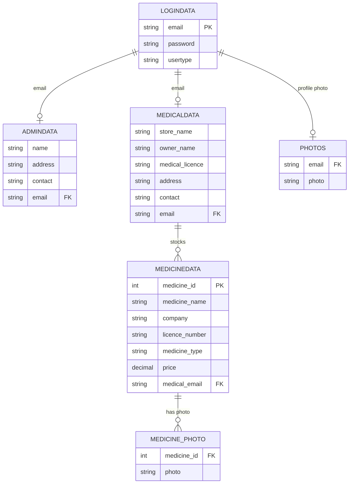

# Medicine Store Management System

A Flask web application that connects **medical stores** (pharmacies) with an **admin**, allowing stores to list medicines, manage photos, and letting the public search for medicine availability and price across registered stores.

> ⚠️ **Schema disclaimer**: The tables/columns below were reverse-engineered from the raw SQL statements in `app.py` (insert/select column order). Exact data types, constraints, and the `medicine_with_photo` view were **not** visible in the provided file (it likely lives in `mylib.py` / your DB dump). Treat the schema as a best-effort reconstruction — verify against your actual database before relying on it.

---

## ⚠️ Known Issues

#### SQL Injection
Most queries use raw string concatenation instead of parameterized queries. User input (email, password, medicine name, etc.) can break out of the query string.

#### Plaintext Passwords
`logindata.password` is stored and compared as plaintext, with no hashing.

#### Hardcoded Secret Key
`app.secret_key = "kinchit"` is hardcoded instead of loaded from `.env`.

#### No Upload Validation
`/medicine_photo`, `/admin_profile_photo`, `/medical_profile_photo` accept any file type/size.

#### Bare `except:` Clauses
Some routes (e.g. `admin_profile_photo`) swallow all errors, making bugs hard to trace.

---

## Features

- **Public**
  - Search medicines by name across all registered stores, sorted by price (`/`).
- **Admin**
  - Register/manage admin accounts (`/adminreg`, `/show_admindata`).
  - Register/edit/delete medical stores (`/medicalreg`, `/show_medicaldata`, `/edit_medical`, `/edit_medical1`, `/del_medical`, `/del_medical1`).
  - Manage own profile, profile photo, and password (`/admin_home`, `/admin_profile_photo`, `/admin_change_profile`, `/edit_admin_profile`, `/change_password_admin`).
- **Medical Store (pharmacy)**
  - Register/edit/delete medicines they stock (`/medicine_reg`, `/show_medicine`, `/edit_medicines`, `/edit_medicine1`, `/del_medicine`, `/del_medicine1`).
  - Upload/change a photo per medicine (`/medicine_photo`, `/medicine_change_photo`).
  - Check rival stores selling the same medicine (`/rival`).
  - Manage own profile, profile photo, and password (`/medical_home`, `/medical_profile_photo`, `/medical_change_profile`, `/edit_medical_profile`, `/change_password_medical`).
- **Auth**
  - Session-based login/logout with role routing (`/login`, `/logout`, `/auth_error`).

---

## Tech Stack

| Layer       | Technology |
|-------------|------------|
| Backend     | Flask (Python) |
| Database    | MySQL (via `pymysql`) |
| Sessions    | Flask server-side session (`session` + `secret_key`) |
| File upload | Werkzeug (`secure_filename`) |
| Config      | `python-dotenv` (`.env` file) |
| Templates   | Jinja2 (`render_template`, files under `templates/`) |
| Static      | `./static/photos` for uploaded images |

---

## Prerequisites

- Python 3.8+
- MySQL server
- `pip`

---

## Setup

```bash
# 1. Clone / navigate into the project
cd your-project-folder

# 2. Create and activate a virtual environment
python -m venv venv
source venv/bin/activate      # Windows: venv\Scripts\activate

# 3. Install dependencies
pip install flask pymysql python-dotenv werkzeug

# 4. Create the upload folder (if not already present)
mkdir -p static/photos

# 5. Create a .env file (see below)

# 6. Run the app
python app.py
```

The app runs in debug mode on the Flask default port (`http://127.0.0.1:5000`) via `app.run(debug=True)`.

### `.env` file

`mylib.py` (not included in this file) presumably reads DB credentials via `get_db_cursor()`. Typical variables to define:

```env
DB_HOST=localhost
DB_USER=root
DB_PASSWORD=your_password
DB_NAME=medicine_store_db
```

> Confirm the actual variable names expected by `get_db_cursor()` in `mylib.py`.

---

## Project Structure (expected)

```
.
├── app.py
├── mylib.py                # DB connection + helper functions (get_db_cursor, getAdmin, getmedical, check_photo, check_photo1)
├── .env
├── static/
│   └── photos/              # uploaded profile/medicine photos
└── templates/
    ├── welcome.html
    ├── login.html
    ├── admin_home.html
    ├── admin_reg.html
    ├── show_admindata.html
    ├── medical_home.html
    ├── medical_reg.html
    ├── show_medicaldata.html
    ├── edit_medical.html
    ├── edit_medical1.html
    ├── del_medical.html
    ├── del_medical1.html
    ├── medicine_reg.html
    ├── Show_medicine.html
    ├── edit_medicines.html
    ├── edit_medicine1.html
    ├── del_medicine.html
    ├── del_medicine1.html
    ├── competition.html
    ├── change_password_admin.html
    ├── change_password_medical.html
    ├── edit_admin_profile.html
    ├── edit_medical_profile.html
    └── auth_error.html
```

---

## Database Schema (reconstructed)

| Table | Columns (inferred order) | Notes |
|---|---|---|
| `logindata` | `email` (PK), `password`, `usertype` | `usertype` ∈ {`admin`, `medical`} |
| `admindata` | `name`, `address`, `contact`, `email` (FK → logindata.email) | |
| `medicaldata` | `store_name`, `owner_name`, `medical_licence`, `address`, `contact`, `email` (FK → logindata.email) | |
| `medicinedata` | `medicine_id` (PK, auto), `medicine_name`, `company`, `licence_number`, `medicine_type`, `price`, `medical_email` (FK → medicaldata.email) | insert uses literal `0` for auto-increment id |
| `medicine_photo` | `medicine_id` (FK → medicinedata.medicine_id), `photo` | one row per medicine photo |
| `photos` | `email` (FK → logindata.email), `photo` | profile photo, one per admin/medical user (insert fails with duplicate-key error if one already exists — implies a UNIQUE/PK constraint on `email`) |
| `medicine_with_photo` | *(view, not defined in app.py)* | queried in `/show_medicine`; likely a join of `medicinedata` + `medicine_photo` |

---

## Entity-Relationship Diagram



*(Renders automatically on GitHub / any Mermaid-compatible Markdown viewer.)*

---

## Route Reference

| Route | Methods | Role Required | Purpose |
|---|---|---|---|
| `/` | GET, POST | Public | Search medicines by name |
| `/login` | GET, POST | Public | Login, sets session |
| `/logout` | GET | Any | Clear session |
| `/auth_error` | GET | Public | Unauthorized-access page |
| `/adminreg` | GET, POST | admin | Register a new admin |
| `/show_admindata` | GET | admin | List all admins |
| `/medicalreg` | GET, POST | admin | Register a new medical store |
| `/show_medicaldata` | GET | admin | List all medical stores |
| `/edit_medical`, `/edit_medical1` | GET, POST | admin | Look up / update a store |
| `/del_medical`, `/del_medical1` | GET, POST | admin | Look up / delete a store |
| `/admin_home` | GET | admin | Admin dashboard |
| `/admin_profile_photo` | GET, POST | admin | Upload profile photo |
| `/admin_change_profile` | GET, POST | admin | Remove profile photo |
| `/edit_admin_profile` | GET, POST | admin | Edit own admin details |
| `/change_password_admin` | GET, POST | admin | Change password |
| `/medicine_reg` | GET, POST | medical | Register a medicine |
| `/show_medicine` | GET | medical | List own medicines |
| `/edit_medicines`, `/edit_medicine1` | GET, POST | medical | Look up / update a medicine |
| `/del_medicine`, `/del_medicine1` | GET, POST | medical | Look up / delete a medicine |
| `/medicine_photo` | GET, POST | medical | Upload a medicine photo |
| `/medicine_change_photo` | GET, POST | medical | Delete a medicine photo |
| `/rival` | GET, POST | medical | Find other stores selling a given medicine |
| `/medical_home` | GET | medical | Store dashboard |
| `/medical_profile_photo` | GET, POST | medical | Upload profile photo |
| `/medical_change_profile` | GET, POST | medical | Remove profile photo |
| `/edit_medical_profile` | GET, POST | medical | Edit own store details |
| `/change_password_medical` | GET, POST | medical | Change password |

---

## Suggested Next Steps

1. Replace all string-concatenated SQL with parameterized queries.
2. Hash passwords with `werkzeug.security`.
3. Move `secret_key` and DB credentials fully into `.env`, and never commit `.env`.
4. Add file-type/size validation on all three upload endpoints.
5. Add a `requirements.txt` and (optionally) a SQL migration/schema file so this README's schema section can be auto-verified instead of inferred.

---

## License

Not specified — add a license (e.g. MIT) if you intend to share or open-source this project.
