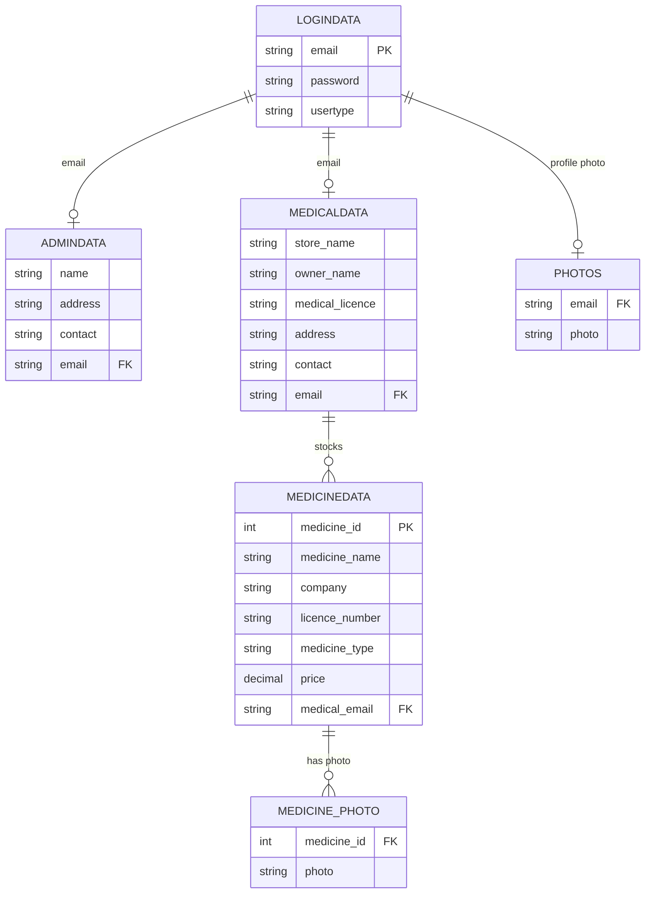

# 💊 Medicine Finder

A full-stack Flask web application that connects **medical stores** (pharmacies) with an **admin**, allowing stores to list medicines, manage photos, and letting the public search for medicine availability and price across registered stores.

**🔗 Live demo:** [medicine-finder-axfw.onrender.com](https://medicine-finder-axfw.onrender.com)

> ⚠️ **Schema disclaimer**: The tables/columns below were reverse-engineered from the raw SQL statements in `mymain.py` (insert/select column order). Exact data types and constraints — and the `medicine_with_photo` view specifically — live in the actual MySQL database, not in this repo. Treat the schema as a best-effort reconstruction; verify against the live database before relying on it.

---

## 📖 Overview

Medicine Finder solves a simple, real problem: quickly checking which local medical stores stock a given medicine and at what price, without calling around. The public-facing search is open to anyone; behind it sits a role-based portal where:

- **Admins** register and manage medical stores, oversee admin accounts, and audit system data.
- **Medical stores** manage their own medicine inventory, pricing, and public listing — including checking what competitors ("rivals") are charging for the same medicine.

---

## ✨ Features

### Public
- 🔍 Search medicines by name across all registered stores, sorted by price (`/`)
- Real-time input validation on search (letters-only, client + server side)

### Admin
- Register/manage admin accounts (`/adminreg`, `/show_admindata`)
- Register/edit/delete medical stores (`/medicalreg`, `/show_medicaldata`, `/edit_medical`, `/edit_medical1`, `/del_medical`, `/del_medical1`)
- Manage own profile, profile photo, and password (`/admin_home`, `/admin_profile_photo`, `/admin_change_profile`, `/edit_admin_profile`, `/change_password_admin`)

### Medical Store (pharmacy)
- Register/edit/delete medicines they stock (`/medicine_reg`, `/show_medicine`, `/edit_medicines`, `/edit_medicine1`, `/del_medicine`, `/del_medicine1`)
- Upload/change a photo per medicine (`/medicine_photo`, `/medicine_change_photo`)
- Check rival stores selling the same medicine (`/rival`)
- Manage own profile, profile photo, and password (`/medical_home`, `/medical_profile_photo`, `/medical_change_profile`, `/edit_medical_profile`, `/change_password_medical`)

### Auth
- Session-based login/logout with role routing (`/login`, `/logout`, `/auth_error`)

---

## 🛠️ Tech Stack

| Layer       | Technology |
|-------------|------------|
| Backend     | Flask (Python) |
| Database    | MySQL, hosted on [Aiven](https://aiven.io), via `pymysql` (SSL-verified connection) |
| Sessions    | Flask server-side session (`session` + `secret_key`) |
| File upload | Werkzeug (`secure_filename`) |
| Config      | `python-dotenv` (`.env` file locally, Render env vars in production) |
| Templates   | Jinja2 (`render_template`, files under `templates/`) |
| Static      | `./static/photos` for uploaded images |
| WSGI Server | Gunicorn (production) |
| Hosting     | Render (web service) |

---

## ⚠️ Known Issues

#### SQL Injection
Most queries use raw string concatenation instead of parameterized queries. User input (email, password, medicine name, etc.) can break out of the query string.

#### Plaintext Passwords
`logindata.password` is stored and compared as plaintext, with no hashing.

#### Hardcoded Secret Key (fixed)
`app.secret_key` previously hardcoded; now reads from the `SECRET_KEY` environment variable, with a local fallback for dev.

#### No Upload Validation
`/medicine_photo`, `/admin_profile_photo`, `/medical_profile_photo` accept any file type/size — no MIME/extension whitelist, no max-size check.

#### Photo Uploads Don't Persist in Production
Render's free-tier filesystem is **ephemeral** — anything saved to `static/photos/` via `file.save(...)` is wiped whenever the service redeploys or restarts after idling. Uploaded profile and medicine photos will silently disappear; the database row referencing the filename remains, but the actual image file is gone, so it'll render broken. This does **not** happen locally, only on the live Render deployment.
**Fix options:** upgrade to a paid Render instance with a persistent Disk mounted at the photos path, or move uploads to a cloud object store (e.g. Cloudinary) and store the returned URL instead of a local filename.

#### Bare `except:` Clauses
Some routes (e.g. `admin_profile_photo`, `medical_profile_photo`) swallow all errors as "Duplicate", making real bugs (bad SQL, connection drops) hard to trace.

#### Case-Sensitive Template Filenames
Some `render_template()` calls reference template names with inconsistent casing (e.g. `Login.html` vs `login.html`, `Show_medicine.html` vs `show_medicine.html`). Windows filesystems ignore case so this works locally, but Linux hosts like Render are case-sensitive and will throw `TemplateNotFound`. Audit every `render_template()` call against the actual filename in `templates/`.

---

## 🗂️ Project Structure

```
medicine_finder/
├── mymain.py               # Flask app: all routes & view logic
├── mylib.py                 # DB connection + helper functions (get_db_cursor, getAdmin, getmedical, check_photo, check_photo1)
├── requirements.txt
├── cal.pem                  # Aiven MySQL CA certificate (public, safe to commit)
├── .env                       # Local environment variables (gitignored)
├── .gitignore
├── static/
│   └── photos/                # uploaded profile/medicine photos (ephemeral on Render free tier — see Known Issues)
└── templates/
    ├── welcome.html
    ├── login.html
    ├── admin_home.html
    ├── admin_reg.html
    ├── show_admindata.html
    ├── medical_home.html
    ├── medical_reg.html
    ├── show_medicaldata.html
    ├── edit_medical.html
    ├── edit_medical1.html
    ├── del_medical.html
    ├── del_medical1.html
    ├── medicine_reg.html
    ├── Show_medicine.html
    ├── edit_medicines.html
    ├── edit_medicine1.html
    ├── del_medicine.html
    ├── del_medicine1.html
    ├── competition.html
    ├── change_password_admin.html
    ├── change_password_medical.html
    ├── edit_admin_profile.html
    ├── edit_medical_profile.html
    └── auth_error.html
```

---

## 🗄️ Database Schema (reconstructed)

| Table | Columns (inferred order) | Notes |
|---|---|---|
| `logindata` | `email` (PK), `password`, `usertype` | `usertype` ∈ {`admin`, `medical`} |
| `admindata` | `name`, `address`, `contact`, `email` (FK → logindata.email) | |
| `medicaldata` | `store_name`, `owner_name`, `medical_licence`, `address`, `contact`, `email` (FK → logindata.email) | |
| `medicinedata` | `medicine_id` (PK, auto), `medicine_name`, `company`, `licence_number`, `medicine_type`, `price`, `medical_email` (FK → medicaldata.email) | insert uses literal `0` for auto-increment id |
| `medicine_photo` | `medicine_id` (FK → medicinedata.medicine_id), `photo` | one row per medicine photo |
| `photos` | `email` (FK → logindata.email), `photo` | profile photo, one per admin/medical user (insert fails with duplicate-key error if one already exists — implies a UNIQUE/PK constraint on `email`) |
| `medicine_with_photo` | *(view)* | queried in `/show_medicine`; joins `medicinedata` + `medicine_photo` |

### Entity-Relationship Diagram



---

## 🧭 Route Reference

| Route | Methods | Role Required | Purpose |
|---|---|---|---|
| `/` | GET, POST | Public | Search medicines by name |
| `/login` | GET, POST | Public | Login, sets session |
| `/logout` | GET | Any | Clear session |
| `/auth_error` | GET | Public | Unauthorized-access page |
| `/adminreg` | GET, POST | admin | Register a new admin |
| `/show_admindata` | GET | admin | List all admins |
| `/medicalreg` | GET, POST | admin | Register a new medical store |
| `/show_medicaldata` | GET | admin | List all medical stores |
| `/edit_medical`, `/edit_medical1` | GET, POST | admin | Look up / update a store |
| `/del_medical`, `/del_medical1` | GET, POST | admin | Look up / delete a store |
| `/admin_home` | GET | admin | Admin dashboard |
| `/admin_profile_photo` | GET, POST | admin | Upload profile photo |
| `/admin_change_profile` | GET, POST | admin | Remove profile photo |
| `/edit_admin_profile` | GET, POST | admin | Edit own admin details |
| `/change_password_admin` | GET, POST | admin | Change password |
| `/medicine_reg` | GET, POST | medical | Register a medicine |
| `/show_medicine` | GET | medical | List own medicines |
| `/edit_medicines`, `/edit_medicine1` | GET, POST | medical | Look up / update a medicine |
| `/del_medicine`, `/del_medicine1` | GET, POST | medical | Look up / delete a medicine |
| `/medicine_photo` | GET, POST | medical | Upload a medicine photo |
| `/medicine_change_photo` | GET, POST | medical | Delete a medicine photo |
| `/rival` | GET, POST | medical | Find other stores selling a given medicine |
| `/medical_home` | GET | medical | Store dashboard |
| `/medical_profile_photo` | GET, POST | medical | Upload profile photo |
| `/medical_change_profile` | GET, POST | medical | Remove profile photo |
| `/edit_medical_profile` | GET, POST | medical | Edit own store details |
| `/change_password_medical` | GET, POST | medical | Change password |

---

## ⚙️ Environment Variables

Create a `.env` file in the project root (never commit this):

```env
DB_HOST=your-aiven-mysql-host.aivencloud.com
DB_PORT=your-aiven-port
DB_USER=avnadmin
DB_PASS=your-db-password
DB_NAME=your-database-name
SECRET_KEY=a-long-random-hex-string
```

Generate a secure `SECRET_KEY` locally:
```bash
python -c "import secrets; print(secrets.token_hex(32))"
```

---

## 🚀 Getting Started Locally

**Prerequisites:** Python 3.8+, a MySQL server, `pip`

```bash
# 1. Clone the repo
git clone https://github.com/kinchitgupta/Medicine-Finder.git
cd Medicine-Finder

# 2. Create and activate a virtual environment
python -m venv .venv
.venv\Scripts\activate        # Windows
source .venv/bin/activate     # macOS/Linux

# 3. Install dependencies
pip install -r requirements.txt

# 4. Create the upload folder (if not already present)
mkdir -p static/photos

# 5. Create your .env file (see Environment Variables above)

# 6. Set up the database — create the tables listed in the schema above

# 7. Run the app
python mymain.py
```
Visit `http://127.0.0.1:5000`

---

## ☁️ Deployment

Deployed on **Render** (web service) connected to a **managed MySQL instance on Aiven**.

- **Build command:** `pip install -r requirements.txt`
- **Start command:** `gunicorn mymain:app`
- **Environment variables:** set in Render's dashboard (Environment tab) — same keys as the local `.env` above
- **SSL certificate:** `cal.pem` (Aiven's CA cert — public, safe to commit) is referenced in `mylib.py` via an **absolute path** built from the file's own location, since relative paths resolve differently under Gunicorn on Render than under the local Flask dev server:
  ```python
  BASE_DIR = os.path.dirname(os.path.abspath(__file__))
  CA_PATH = os.path.join(BASE_DIR, 'cal.pem')
  ```
- `debug=False` in production — the interactive Flask debugger is never exposed publicly.

---


## 👤 Author

**Kinchit Gupta**
- 📧 kinchitgupta08@gmail.com

---
